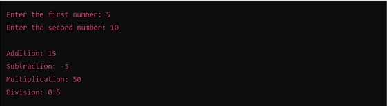
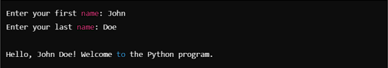

## Task 1: Perform Basic Mathematical Operations

**Problem Statement:**  
Write a Python program that does the following:

1. Takes two numbers as input from the user.  
2. Performs the basic mathematical operations on these two numbers:  
   - Addition  
   - Subtraction  
   - Multiplication  
   - Division  
3. Displays the results of each operation on the screen.  

**Expected Output:**  
The output should include the result of each operation performed, for example:  

---

## Task 2: Create a Personalized Greeting

**Problem Statement:**  
Write a Python program that:

1. Takes a user's first name and last name as input.  
2. Concatenates the first name and last name into a full name.  
3. Prints a personalized greeting message using the full name.  

**Expected Output:**  
The program should output a greeting like:  

