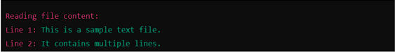

# Task 1: Read a File and Handle Errors

## Problem Statement
Write a Python program that:
1. Opens and reads a text file named `sample.txt`.
2. Prints its content line by line.
3. Handles errors gracefully if the file does not exist.

## Expected Output
- If the file exists:

- If the file does not exist:

---

# Task 2: Write and Append Data to a File

## Problem Statement
Write a Python program that:
1. Takes user input and writes it to a file named `output.txt`.
2. Appends additional data to the same file.
3. Reads and displays the final content of the file.

## Expected Output
- For example, the output should be:
